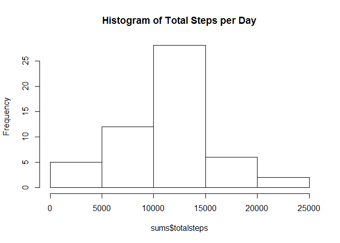
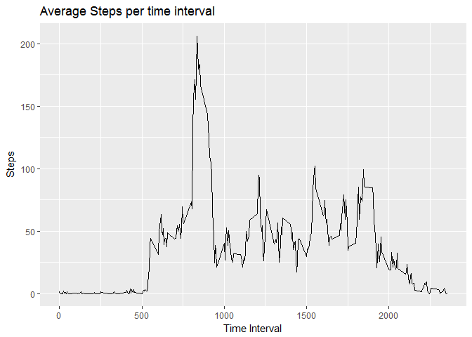
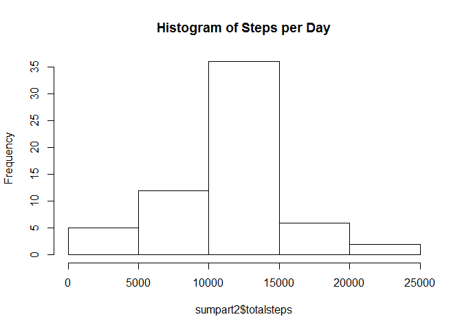
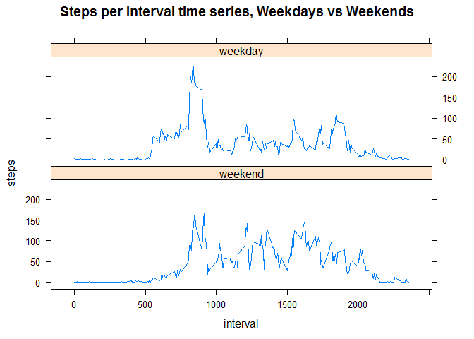

# Reproducible Research: Peer Assessment 1


## Loading and preprocessing the data


```r
#load data and get the ggplot2 and lattice libraries
activity <-read.csv("~/activity.csv")
library(ggplot2)
library(lattice)
```


## What is mean total number of steps taken per day?


```r
#part 1
#daily step sums
sums <- aggregate(activity$steps~activity$date, FUN = sum)
 
colnames(sums) <- c("date", "totalsteps")
#histogram totalsteps 
hist(sums$totalsteps, main = "Histogram of Total Steps per Day")
```

<!-- -->
Now we calculate the mean and median of this total steps distribution

The Mean

```r
#mean/median totalsteps
mean(sums$totalsteps)
```

```
## [1] 10766.19
```
And the Median

```r
median(sums$totalsteps)
```

```
## [1] 10765
```


## What is the average daily activity pattern?
Here we show the Average daily activity pattern by finding the mean for each time interval 
across all the days in this study.


```r
#intervals means
meandaily <- aggregate(activity$steps ~ activity$interval, FUN = mean)
colnames(meandaily) <- c("interval", "steps")

#plot the daily chart of steps
qplot(meandaily$interval, meandaily$steps, geom = "line", xlab = "Time Interval", ylab = "Steps", main = "Average Steps per time interval")
```

<!-- -->

Which time interval had the maximum number of steps?

```r
#find the time for the max number of steps
meandaily[meandaily$steps == max(meandaily$steps),]
```

```
##     interval    steps
## 104      835 206.1698
```


## Imputing missing values

How many missing values do we have

```r
#find number of missing values
length(is.na(activity$steps))
```

```
## [1] 17568
```

The missing values will be replaced with mean for that 
time interval across all days


```r
#merge the mean data set so that the mean is next to the actual value
tempset<-merge(meandaily, activity, by = "interval")
naindices<-is.na(tempset$steps.y)

#replace locations where the value is na
tempset$steps.y[naindices] <- tempset$steps.x[naindices]

#reorder based on date
finalset <- tempset[order(tempset$date),]

#give intuitive column names
colnames(finalset) <- c("interval", "intervalMean", "steps", "date")
```

Here is the histogram of the revised data with the missing values replaced

```r
sumpart2 <- aggregate(finalset$steps ~ finalset$date, FUN = sum)
colnames(sumpart2) <- c("date", "totalsteps")

#histogram and mean and median

hist(sumpart2$totalsteps, main = "Histogram of Steps per Day")
```

<!-- -->

Let's take a look at the mean and median values for the new set with imputed values

The Mean

```r
mean(sumpart2$totalsteps)
```

```
## [1] 10766.19
```

And The Median

```r
median(sumpart2$totalsteps)
```

```
## [1] 10766.19
```

By looking at the Histogram, the mean, and the median, of this new data it appears
that imputing the missing values does not greatly distort our data set, but 
pushes it more towards the mean and median increasing the frequency of the mean total 
steps as shown by the histogram.


## Are there differences in activity patterns between weekdays and weekends?
Here we will add a label to the data set to differentiate
between weekdays and weekends.

The plot shown at the end shows the average step pattern for weekdays
and weekends.


```r
#add day of week
finalset$dayofweek <- weekdays(as.Date(finalset$date))
weekdaytitles <- c("Monday", "Tuesday", "Wednesday", "Thursday", "Friday")

#factor for weekend and weekday
finalset$Day <- factor(finalset$dayofweek %in% weekdaytitles, levels = c(FALSE, TRUE), labels = c("weekend", "weekday"))

#average for weekend and weekday
mean2 <- aggregate(finalset$steps ~ finalset$interval + finalset$Day, FUN = mean)
colnames(mean2) <- c("interval", "Day", "steps")

#plot panel plot
xyplot(steps ~ interval | Day, data = mean2, layout = c(1,2), type = "l", main = "Steps per interval time series, Weekdays vs Weekends")
```

<!-- -->
